# Chitchat AI Application (Open-AI)

App Features :

- Suggestions to ask questions 
- Ask AI screen
- History screen
- Settings screen
- Supported Light-Dark theme
- Supported Android latest version
- Google Ads

## Index
[How to setup Firebase for the app](#How-to-setup-Firebase-for-the-app)

[How to edit Application in Android Studio](#How-to-edit-Application-in-Android-Studio:)

## How to setup Firebase for the app :

Steps:

- First make an account in Firebase (if you have already an account in Firebase then skip the step)

- Make a Project in Firebase (Project name: You can give any name to the project For example ChitChat App)

1) **Go to Firebase Click on "Go to Console"** 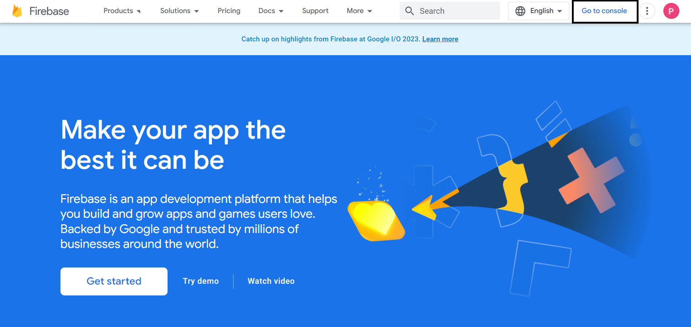

2) **Create a Project** 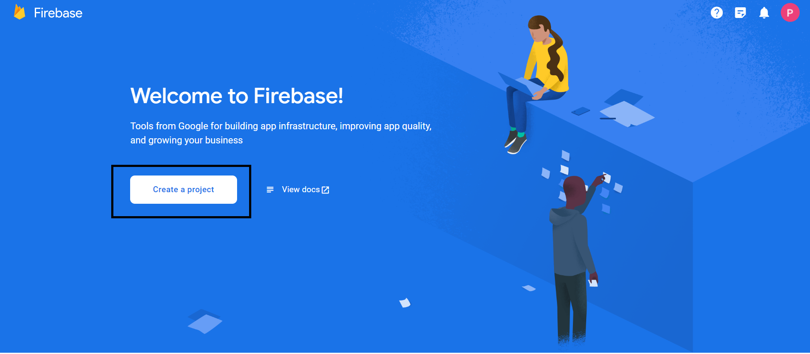

3) **Add Project Name -> Accept Firebase Terms and Confirm -> Click on "Continue"** 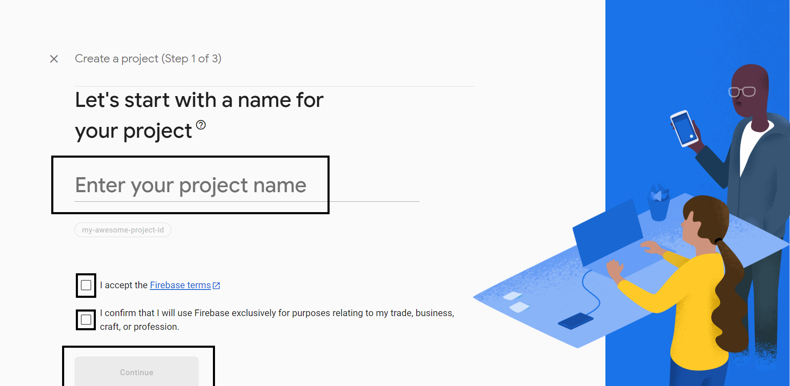

4) **Click on "Continue"**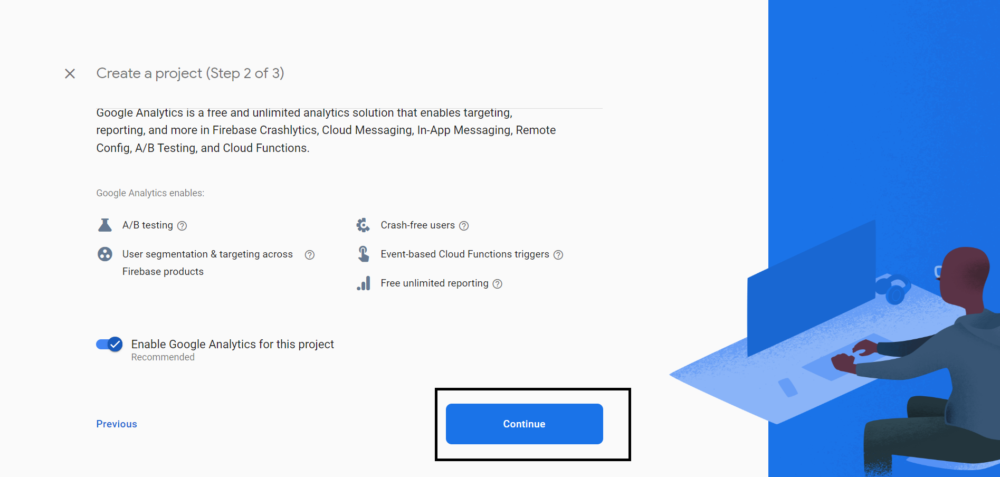

5) **Accept Google Analytics -> Click on "Create project"** 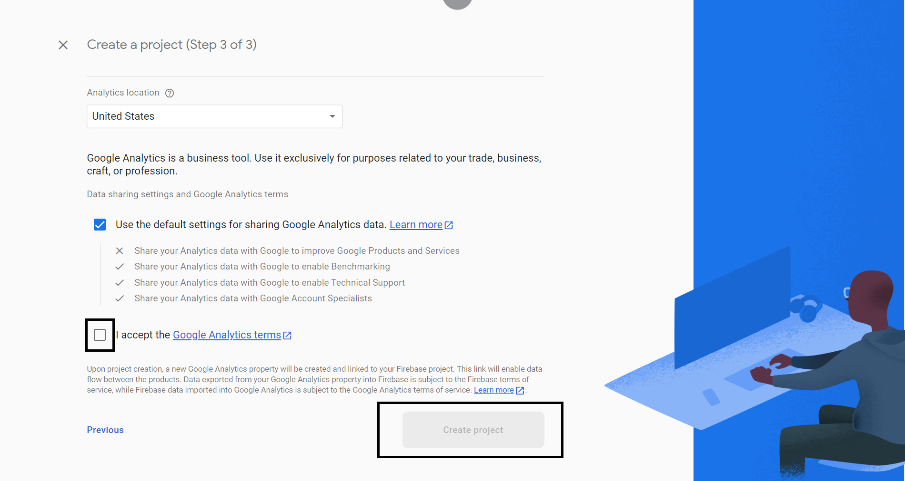

6) **Wait a moment. it will takes 10-20 seconds. -> Click on "Continue"** 

7) **Project Ready then Click on "Android Icon"** 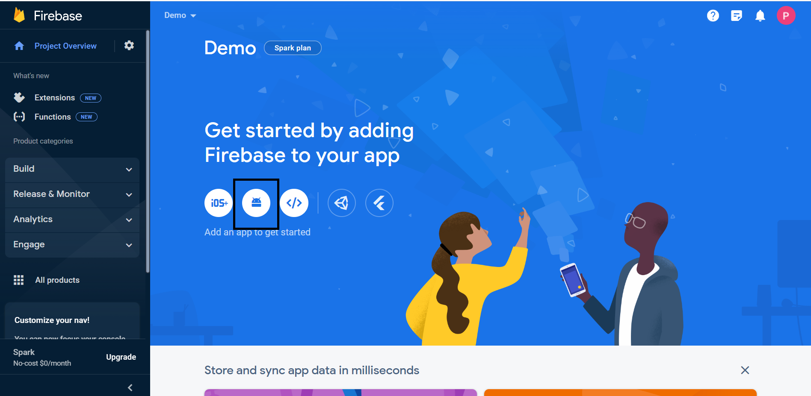

8) **Enter Package Name(As per your Project) -> Click On "Register app"** 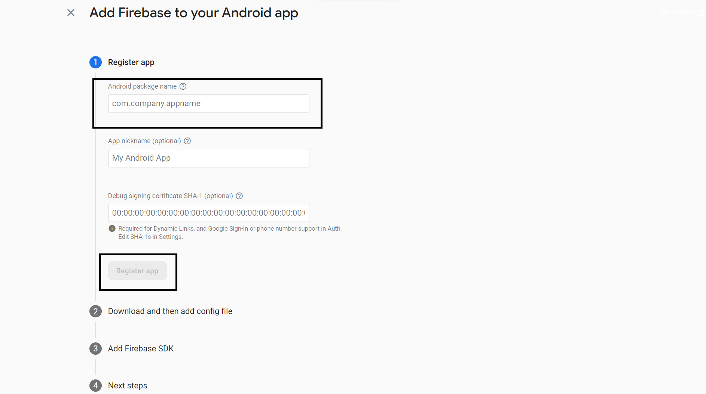

9) **Download the "google-services.json" File -> Click on "Next"** 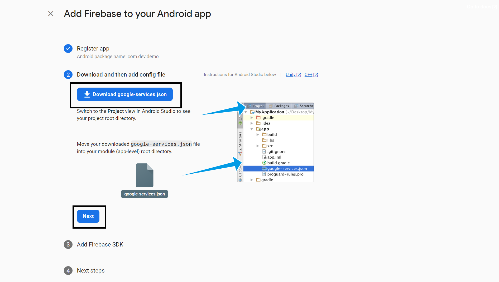

10) **Not required to Add anything -> Click on "Next** 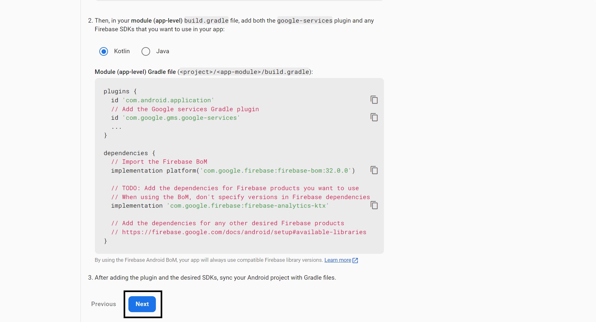

11) **Click on "Continue to console** 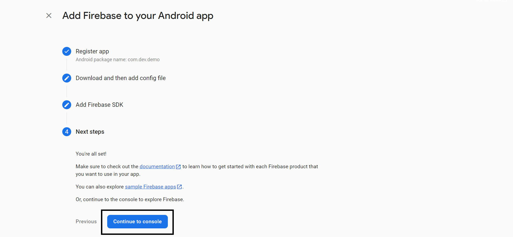

12) **Firebase Project Created Successfully -> Go to Build -> Click on "Firestore Database"** 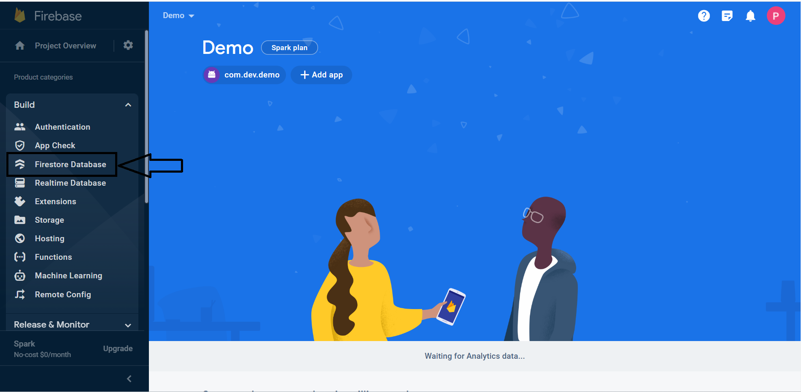

13) **Click on "Create Database"** 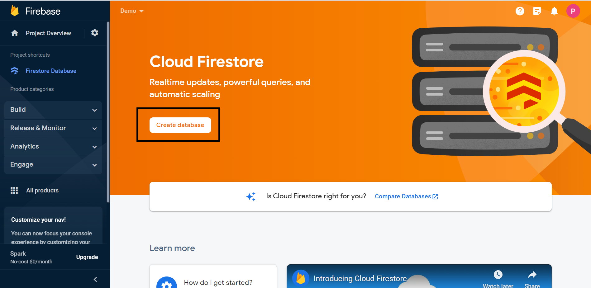

14) **Click on "Test Mode" -> Click on "Next"** 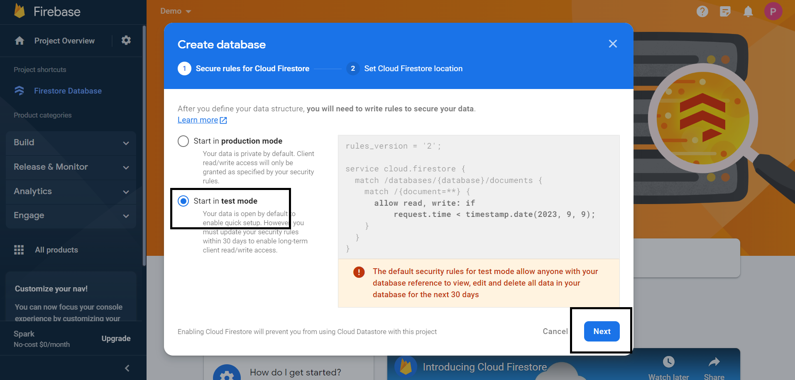

15) **Click on "Enable"** 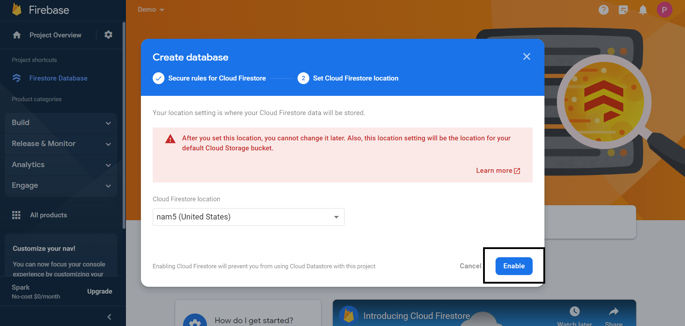

16) **You can see your database in this Section** 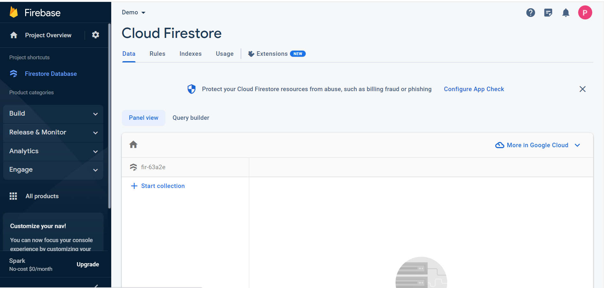

 Finally, We finished the Firebase setup successfully.

## How to edit Application in Android Studio:

Steps:
 
1) Download the Zip File
2) Unzip the File
3) Open Unzipped Folder in Android Studio(File -> Open -> Choose your Unzipped Folder and Click on "OK") 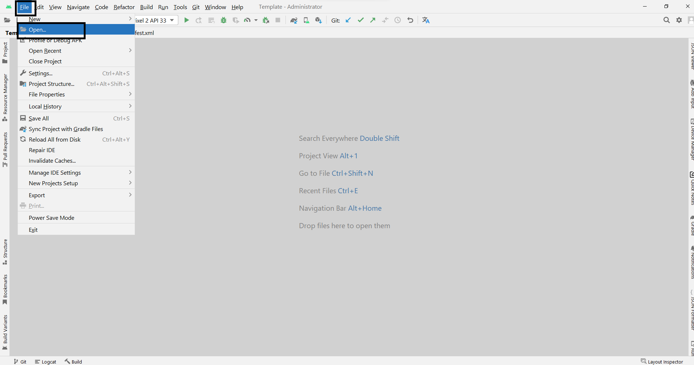
4) Paste the downloaded "google-services.json" in "app" Folder 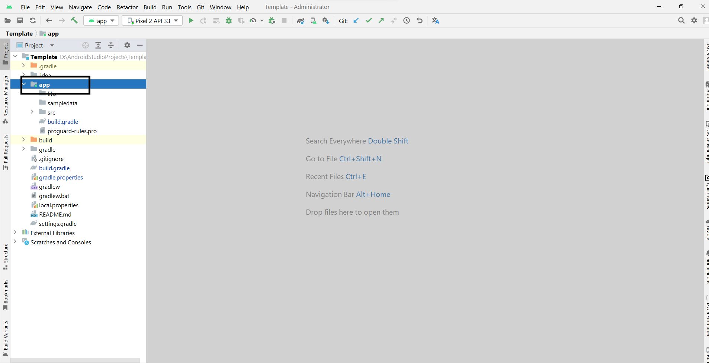
5) Android Studio setup is finished
6) Run your Project. 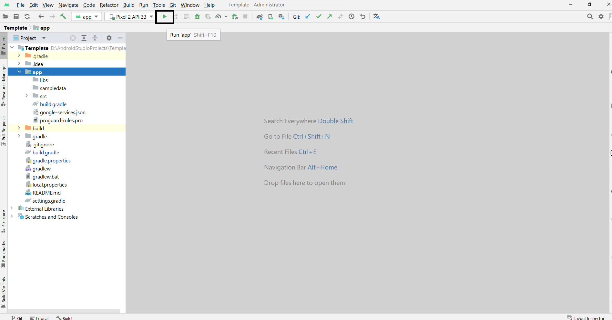
7) Replace "Add_Main_Ads_ID" and "Add_Banner_Ads_ID" with your Ads ID.
8) Replace "Open_AI_Access_Token" with your open AI access token

Happy Coding . . .
